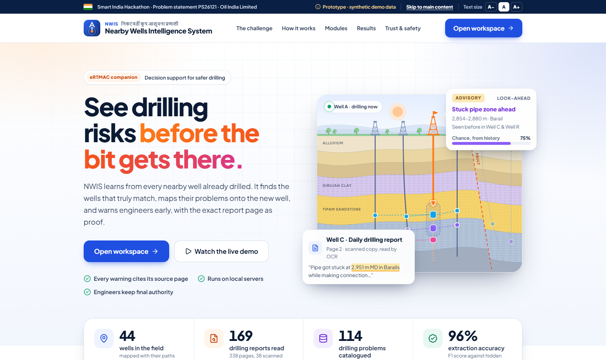
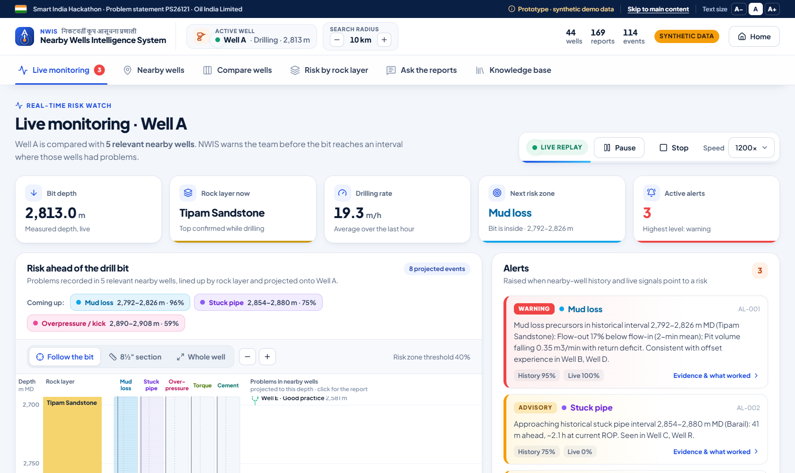

# eRTMAC–NWIS · Nearby Wells Intelligence System (prototype)

**SIH PS26121 · Oil India Limited.** NWIS is a decision-support layer that runs next to eRTMAC. It keeps comparing the active well with the offset wells that are actually relevant, lined up by position, depth and formation. It warns engineers **before** they reach a risky interval, and every warning links to the exact page of the report it came from.

> All wells, reports and drilling data here are **synthetic demo data**. They are not real OIL records, and the UI labels them that way. The ingestion pipeline is built so that real OIL documents and feeds can replace the demo data without redesign.





## Quick start

Requirements: Python 3.11+ and Node 18+. You don't need Docker, a GPU, internet access or API keys (the map basemap is optional and loads online).

```powershell
.\run.ps1          # Windows: venv + deps, build data/KB/models/evaluation, build UI, serve on :8000
./run.sh           # Linux / macOS / Git Bash
```

Then open **http://localhost:8000** for the landing page, and select **Open workspace** to enter the tool. To start straight into the demo replay, open **http://localhost:8000/?autostart=2740&speed=300**.

The first build takes about 5 minutes, mostly OCR of the scanned reports. OCR results are cached, so later builds take about 1 minute.

Manual steps:

```bash
cd backend
python -m venv .venv && .venv/Scripts/pip install -r requirements.txt   # (bin/pip on Linux)
.venv/Scripts/python -m nwis.build_all          # synthetic data -> ingestion -> models -> evaluation
.venv/Scripts/python -m uvicorn nwis.api.main:app --port 8000
cd ../frontend && npm install && npx vite         # dev UI on :5173 (proxies /api to :8000)
.venv/Scripts/python -m unittest discover -s tests -t .   # unit tests (from backend/)
```

Optional: a local LLM for prose answers. Run `ollama pull qwen2.5:3b`, then set `NWIS_LLM_MODEL=qwen2.5:3b` before starting the API. Answers still go through the citation checker. Without an LLM, answers are extractive: verbatim sentences only.

## Demo script (7 minutes, follows the scenario in PS §4)

| Step | Where | What to show | PS req |
|---|---|---|---|
| 1 | Nearby wells | Radius 10 km. **Well G is 2 km away but ranks low**: it sits across a fault, with thinner Tipam and no Namsang. **Well E, 8 km away, ranks higher**: same compartment. Click a well to see the relevance breakdown. | R1 |
| 2 | Compare wells | Aligned on the top of Barail. The mud losses in B and D line up in lower Tipam even though their MDs are 2,769 m and 2,891 m. | R3 |
| 3 | Risk by rock layer | Tipam × mud loss: posterior 29% (90% CI 7–57%), 2 of 5 relevant wells, mean NPT 24.8 h. Barail × stuck pipe and overpressure. | R4 |
| 4 | Live monitoring → Start live replay (from 2,740 m) | Risk zones ahead: **mud loss 2,792–2,826 m**, **stuck pipe 2,854–2,880 m**, **overpressure 2,890–2,908 m** (PS scenario: 2,820 / 2,870 / 2,900 m). | R5 |
| 5 | Alerts (Live monitoring) | ADVISORY 52 m ahead → CAUTION on entering the zone → **WARNING about 1 m after the real loss begins** (flow-out deficit). A pit transfer at 2,765 m raises nothing. Once the Barail top is picked 6 m shallower than prognosed, the zones re-align and the alerts keep their identity. | R6 |
| 6 | Click an alert | History vs live probability, live indicators, the offset events behind the zone with document and page links, and *what was done before*: ranked mitigations with outcomes, plus the practice that worked in trouble-free Well E. | R7 |
| 7 | Ask the reports | "What caused the stuck pipe in Well C and how was it freed?" returns an answer quoting a **scanned** DDR (OCR); clicking a citation opens the page with the sentence highlighted. "Any kick problems in Well G?" returns **insufficient evidence**. Then **Knowledge base → Accuracy report** shows the measured results. | R2 |

## Measured results (synthetic benchmark with hidden ground truth)

| Component | Result |
|---|---|
| Event extraction from 169 reports (338 pages, 38 via OCR) | Precision **98%**, recall **94%**, F1 **96%**. Digital recall 100%; scanned-only recall 84%. |
| Depth / formation / provenance | Depth error median 0.1 m, P90 0.4 m · formation **100%** · **170/170** quotes found verbatim on the cited page |
| Offset relevance (leave-one-well-out) | NDCG@5 0.479 vs 0.441 for distance-only (**+8.7%**) |
| Look-ahead backtest (only wells drilled earlier) | Catches **31%** of held-out events vs **6%** for a raw-depth, nearest-well baseline, flagging 7% of the hole |
| Real-time precursors (cross-validated by well) | AUC 0.97–0.999 · event recall 100% · median lead 7–32 min · ≤ 2 false alarms per 24 h of drilling |
| Ask NWIS | Retrieval recall@5 **98%** on 60 golden questions · **100%** correct "insufficient evidence" on 38 unanswerable questions |

These are prototype numbers on synthetic data, where the hazard model is random by design (not every event can be predicted from offsets). Re-baseline on real OIL data.

## How the plan maps to the code

| Plan section | Module |
|---|---|
| §6 Correctness layer: minimum curvature, TVDSS, units, CRS | `backend/nwis/core/` (`trajectory.py`, `units.py`, `geo.py`) |
| §5.3 Taxonomy and drilling lexicon | `backend/nwis/core/taxonomy.py` |
| §7 Document pipeline: text layer / OCR, extraction, validation, dedupe | `backend/nwis/ingest/` (`pdf_text.py`, `extractor.py`, `pipeline.py`) |
| §8.1 Offset relevance, per formation interval | `backend/nwis/engines/relevance.py` |
| §8.2–8.4 Alignment, Bayesian formation risk, look-ahead track | `backend/nwis/engines/risk.py` |
| §8.5 Precursors: Tier-1 rules + Tier-2 calibrated models | `backend/nwis/engines/precursors.py` |
| §8.6–8.7 Fusion and alert engine | `backend/nwis/engines/alerts.py` |
| §8.8 Grounded search with fixed query tools | `backend/nwis/engines/search.py` |
| §8.9 Case-based recommendations | `backend/nwis/engines/recommend.py` |
| §9 eRTMAC feed (replay simulator standing in for the adapter) | `backend/nwis/api/replay.py`, WebSocket `/api/ws/replay` |
| §11 API | `backend/nwis/api/main.py` (OpenAPI docs at `/docs`) |
| §13 Synthetic field with ground truth | `backend/nwis/synthetic/` |
| §14 Evaluation harness | `backend/nwis/evaluation.py` |
| §10 Landing page and workspace UI | `frontend/src/` (`landing/`, `views/`, `components/`) |

## Prototype simplifications (what a pilot would change)

| Prototype | Pilot / production (per the implementation plan) |
|---|---|
| SQLite knowledge base plus in-memory engines | PostgreSQL + PostGIS + pgvector + TimescaleDB |
| Rule/lexicon extractor (deterministic and measured) | Add a schema-constrained local LLM extractor behind the same output schema; keep the verbatim-quote check |
| BM25 with drilling synonyms; LLM optional | Hybrid BM25 + dense embeddings + reranker, served on-prem |
| Replay simulator replaces the eRTMAC adapter | WITSML 1.4.1.1/2.0 or ETP 1.2 connector with a config-driven mnemonic map (ROPA, HKLA, TQA, SPPA, MFIA/MFOP, TVA…) feeding the same `FeatureState` |
| Local tangent-plane coordinates | PROJ with explicit source datum (e.g. Kalianpur 1975 → UTM 46N) |
| No authentication; audit log only | Keycloak/AD, role-based access, TLS, offline map tiles |
| Thresholds and formation hazards set by the team | Validated by OIL drilling and geoscience experts |

## Using real data

1. Put PDFs in `backend/data/source/documents/` named `<WELLID>-<DDR|WCR>-<date>.pdf`. The file name stands in for DMS metadata, and the well named inside the document is cross-checked.
2. Provide `well_master.json`: headers, surveys (MD, inclination, azimuth), formation tops, casing and sections. It follows the same schema as the generated file.
3. Run `python -m nwis.ingest.pipeline`, then `python -m nwis.evaluation`. Extraction metrics need a labelled sample, which the Curator console produces.
